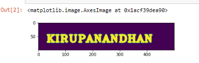
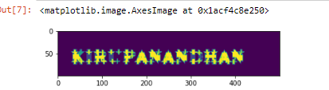
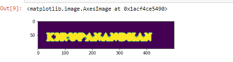

# Opening-and-Closing

## Aim
To implement Opening and Closing using Python and OpenCV.

## Software Required
1. Anaconda - Python 3.7
2. OpenCV
## Algorithm:
### Step1:
<br>Import the necessary packages

### Step2:
<br>Create the Text using cv2.putText

### Step3:
<br>Create the structuring element

### Step4:
<br>Use Opening operation

### Step5:
<br>Use Closing Operation

 
## Program:

``` Python
# Import the necessary packages
import cv2
import numpy as np
from matplotlib import pyplot as plt


# Create the Text using cv2.putText
img1=np.zeros((100,500),dtype='uint8')
font=cv2.FONT_HERSHEY_COMPLEX_SMALL
img=cv2.putText(img1,' BHARATH ',(5,70),font,2,(255),5,cv2.LINE_AA)
plt.imshow(img)


# Create the structuring element
Kernel=cv2.getStructuringElement(cv2.MORPH_CROSS,(11,11))


# Use Opening operation
image1=cv2.morphologyEx(im,cv2.MORPH_OPEN,Kernel)
plt.imshow(image1)


# Use Closing Operation
image1=cv2.morphologyEx(im,cv2.MORPH_CLOSE,Kernel)
plt.imshow(image1)


```
## Output:

### Display the input Image

<br>
<br>
<br>
<br>
<br>

### Display the result of Opening

<br>
<br>
<br>
<br>
<br>

### Display the result of Closing

<br>
<br>
<br>
<br>
<br>

## Result
Thus the Opening and Closing operation is used in the image using python and OpenCV.